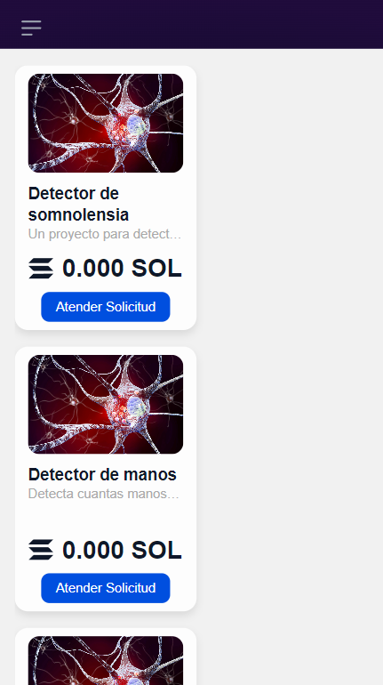
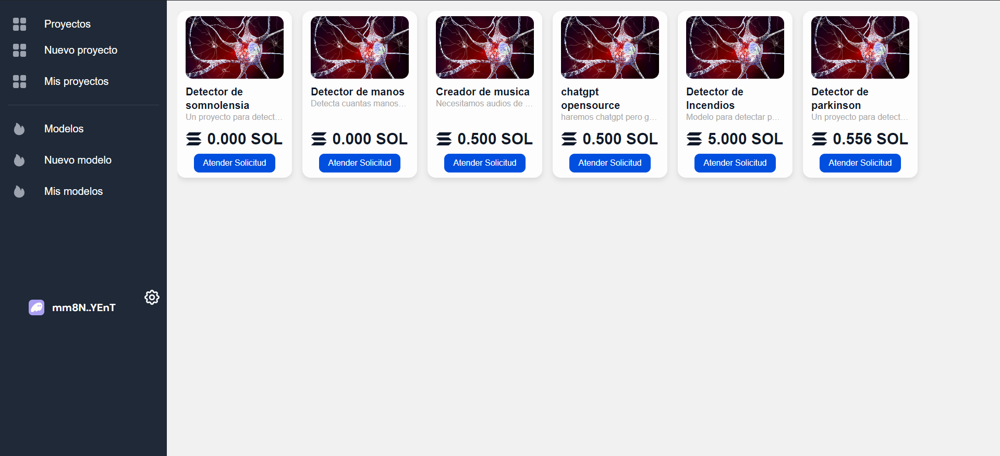

# Frontend para el proyecto Cobalt.ai

Cobalt es una innovadora plataforma colaborativa de entrenamiento de IA que permite a usuarios y desarrolladores proporcionar y acceder a datos de entrenamiento (como vídeos, imágenes, texto, etc.) y recursos de computación (GPU, CPU, RAM) de manera eficiente y descentralizada.


Responsive                     |  Desktop
:-------------------------:|:-------------------------:
  |  

## 🌐 Acceso Rápido

Este proyecto se desarrolló utilizando Next.js y la blockchain de Solana, ofreciendo una experiencia de usuario fluida y segura.
Visita [Cobalt.ai](https://cobalt-blond.vercel.app/) para explorar la plataforma.

### 📦 Estructura del Proyecto

El proyecto sigue una estructura modular para facilitar el mantenimiento y la escalabilidad.
 
```
├── public : publically hosted files
├── src : primary code folders and files 
│   ├── components : should house anything considered a resuable UI component
│   ├── contexts` : any context considered reusable and useuful to many compoennts that can be passed down through a component tree
│   ├── hooks` : any functions that let you 'hook' into react state or lifecycle features from function components
│   ├── models` : any data structure that may be reused throughout the project
│   ├── pages` : the pages that host meta data and the intended `View` for the page
│   ├── stores` : stores used in state management
│   ├── styles` : contain any global and reusable styles
│   ├── utils` : any other functionality considered reusable code that can be referenced
│   ├── views` : contains the actual views of the project that include the main content and components within
style, package, configuration, and other project files

```

### 🤝 Contribuyendo
Las contribuciones son lo que hacen que la comunidad de código abierto sea un lugar increíble para aprender, inspirar y crear. Cualquier contribución que hagas será muy apreciada.

1. Haz Fork del proyecto
2. Crea tu rama de características (git checkout -b feature/AmazingFeature)
3. Realiza tus cambios y haz commit (git commit -m 'Add some AmazingFeature')
4. Haz Push a la rama (git push origin feature/AmazingFeature)
5. Abre un Pull Request
You can check out [the Next.js GitHub repository](https://github.com/vercel/next.js/) - your feedback and contributions are welcome!

## Deploy on Vercel

The easiest way to deploy your Next.js app is to use the [Vercel Platform](https://vercel.com/new?utm_medium=default-template&filter=next.js&utm_source=create-next-app&utm_campaign=create-next-app-readme) from the creators of Next.js.

Check out our [Next.js deployment documentation](https://nextjs.org/docs/deployment) for more details.
